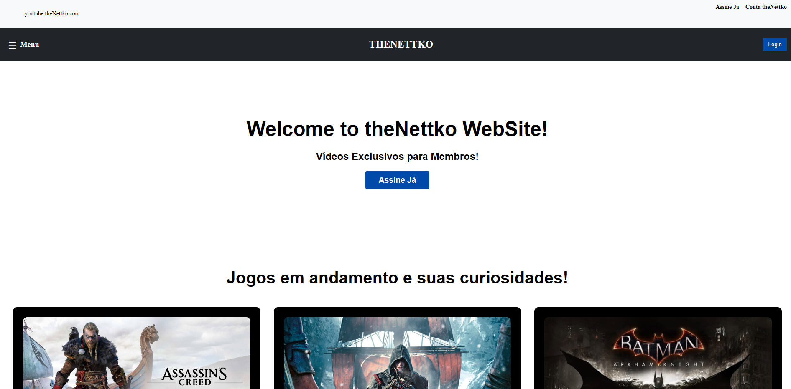

# theNettko



Bem-vindo ao **theNettko**! Este projeto é um site dedicado a fornecer informações sobre games, incluindo vídeos, notícias e atualizações relacionadas a games e programação. O **theNettko** foi criado em 2015 como um canal do YouTube, e agora estamos expandindo nosso conteúdo para incluir um site interativo que oferece uma experiência completa para entusiastas de jogos e programação.

## Funcionalidades

- **Vídeos de Games**: Exiba vídeos recentes do YouTube relacionados ao canal de jogos.
- **Notícias sobre Games**: Mantenha-se atualizado com as últimas notícias e novidades no mundo dos games.
- **Podcasts sobre Games e Programação**: Ouça podcasts informativos sobre games e programação para expandir seu conhecimento e ficar por dentro das tendências do setor.
- **Sistema de Membros**: Usuários cadastrados na plataforma podem receber notificações de novidades e atualizações.
- **Sistema de Login**: Gerencie o acesso dos usuários com funcionalidades de login e autenticação.

## Tecnologias Utilizadas

- **Frontend/Backend**: React
- **API**: YouTube Data API v3
- **Estilização**: CSS

## Requisitos

- **Node.js**: Versão 14.x ou superior
- **NPM**: Versão 6.x ou superior

## Configuração do Ambiente

Para configurar o projeto localmente, siga as instruções abaixo:

## Configuração

Para configurar o projeto, você precisará de um arquivo `.env` com as seguintes variáveis de ambiente:

1. **Crie um arquivo `.env` na raiz do projeto.**
2. **Adicione as seguintes variáveis de ambiente ao arquivo `.env`:**

   ```plaintext
   REACT_APP_YOUTUBE_API_KEY=YOUR_API_KEY
   REACT_APP_YOUTUBE_CHANNEL_ID=YOUR_CHANNEL_ID
   ```

### 1. Clonar o Repositório

Clone este repositório para o seu ambiente local:

```bash
git clone https://github.com/seu-usuario/the-nettko.git
cd the-nettko
```
